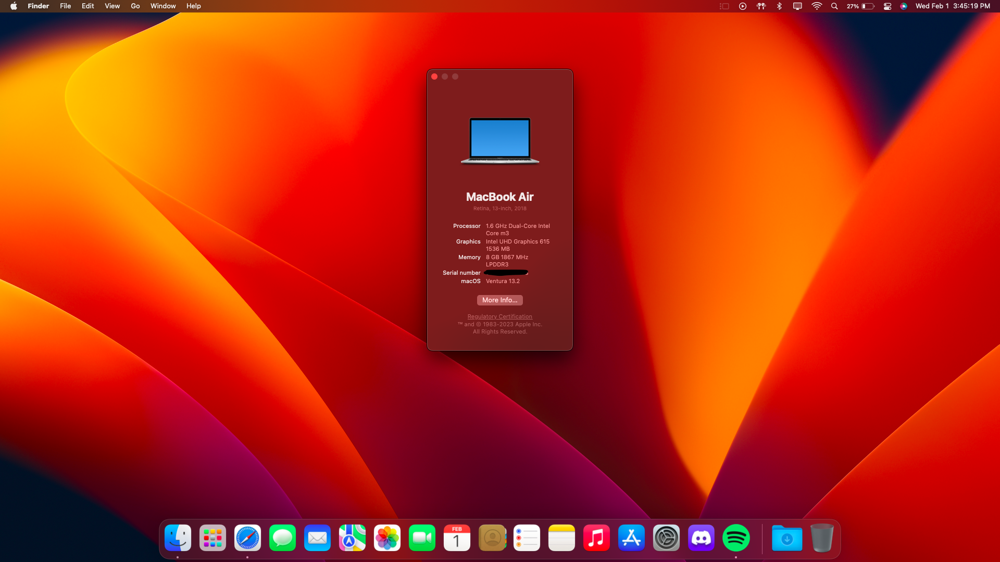

# Installing macOS on an ASUS Chromebook C425

Turns out, this laptop works quite well with macOS. For more information about the Chromebook's hardware, refer to [here](https://github.com/meghan06/ChromebookOSX/blob/main/Hardware.txt).

## Current Status

| **Feature**        | **Status**           | **Notes**                                                         |
|--------------------|----------------------|-------------------------------------------------------------------|
| WiFi               | Working              | With `itlwm.kext` and Heliport                                    |
| Bluetooth          | Working              | With IntelBluetoothFirmware                                       |
| Suspend / Sleep    | Working partially    | Only on battery power, working with `EmeraldSDHC.kext`            |
| Trackpad           | Working              | With `VoodooI2C.kext` and `VoodooI2CELAN.kext`                    |
| Graphics Accel.    | Working              | With `-igfxnotelemetryload` in the `boot-args`                    |
| Internal Speakers  | Not working          | Unsupported codec                                                 |                            
| Keyboard backlight | Working              | With `SSDT-KBBl.aml` and `VoodoolPS2-Chromebook.kext`             |                                           
| Keyboard & Remaps  | Working              | With `VoodoolPS2-Chromebook.kext`                                 |
| eMMC Storage       | Working              | With `EmeraldSDHC.kext`                                           |
| SD Card Reader     | Not working          | Coming soon with `EmeraldSDHC.kext`                               |
| USB Ports          | Working              | Make sure to map your USB ports                                   |
| Webcam             | Working              | Working OOTB                                                      |
| Internal Mic.      | Not working          |                                                                   |
| Logout / Lock      | Working              | Working OOTB                                                      |

Please do not ask me for the EFI, make it yourself and you might learn a thing or two along the way. :) It'll save you time troubleshooting too!

--
### Requirements

Before you start, you'll need to have the following things to complete the process:

- A external storage device (can range from a SD card to a USB Disk) for creating the installer.  
- The latest OpenCore version (at least 0.8.8)   
- An understanding that this process has the potential to damage / brick your device, potentially causing it to become inoperable.

### Disclaimer

The instructions outlined in this document have the potential to cause permanent harm to your laptop, and you should be aware of this potential outcome before proceeding. I cannot be held accountable for any damage resulting from following or disregarding these instructions and make no promises regarding the reliability or efficiency of the software contained in this repository.

### Installation

Here are the steps to go from chromeOS to macOS via OpenCore on your Chromebook. 

## **The following steps are **requried** for proper functioning.**
1. If you haven't already, flash your Chromebook with [MrChromebox's UEFI firmware](https://mrchromebox.tech) via his scripts. To complete this process, you must turn off write protection either by using a SuzyQable cable or temporarily removing the battery (latter is less cumbersome).

2. Setup your EFI folder using the [OpenCore Guide](https://dortania.github.io/OpenCore-Install-Guide/). 
    
3. Do switch VoodoolPS2 with this [custom build](https://github.com/one8three/VoodooPS2-Chromebook/releases) for keyboard backlight control + custom       remaps 
   - Keyboard backlight SSDT can be found [here](https://github.com/one8three/VoodooPS2-Chromebook/blob/master/SSDT-KBBL.aml). 

4. Download corpnewt's SSDTTime, open it, select the first option `FixHPET`, choose `C` for default, and drag the SSDT it makes (`SSDT-HPET`) into your `ACPI` folder. Then, in the same folder, copy the patches from `oc_patches.plist` into your config.plist under `ACPI -> Patch`. Without it, eMMC won't be recognized by macOS. (this is a bug with EmeraldSDHC)

5. Install macOS and enjoy!

### Things not mentioned in the Dortania guide that you need to add:
   - you will regret it later if you don't 
   - Use Laptop Kaby Lake for your config.plist 
   - In your `config.plist`, search (`ctrl + f`) for `ProtectMemoryReigons`, and set it to `TRUE` if you want working shutdown/restart.
   - In your `boot-args`, add `watchdog=0` and `-igfxnotelemetryload`
   - Despite what the guide says, your SMBIOS should be `MacBookAir8,1`. 
   - If you choose to use `MacBook10,1`, you will NOT have Low Battery Mode.

### Kext's.
You can find a list of what I used [here.](https://github.com/meghan06/ChromebookOSX/blob/main/list%20of%20installed%20kext's.png)

### macOS Ventura
#### Only for those who want to update to macOS Ventura.
Before we get started, you should know the following:
- Your battery will drain faster on Ventura. To avoid this, stay on Monterey or older.
- Intel WiFi works, but is a little iffy during startup. It'll take a few seconds (`~20s`) after login for it to connect.
- If you want to install Ventura, you need to install macOS 12 (Monterey) first, then update from System Preferences as AirportItlwm does not work with the C425's WiFi card atm. 

With that, l3ts get started!

### Preparations
1. Mount your EFI using corpnewt's MountEFI.
2. Under OC/Kexts, delete your old itlwm/AirportItlwm kext and replace it with `itlwm v.2.2.0 alpha`
3. Download and install Heliport if you haven't already. The most recent stable release will work fine.
4. Launch ProperTree and reload (`ctrl+r`) your `config.plist`. 
5. Start the update. 

You are now ready for macOS Ventura! 

### Misc. Information
- When formatting the eMMC drive in Disk Utility, make sure to toggle "Show all Drives" and erase the WHOLE drive, not just one partition.
- Format the drive as `APFS`
- Map your USB ports prior to installing macOS for a painless install. You will reget it if you don't. You can use [USBToolBox](https://github.com/USBToolBox/tool) to do that.
- `itlwm` is more stable & faster than `AirportItlwm`
- You might have some text render and DRM issues, there's no fix for this. :(
- Control keyboard backlight with left `ctrl` + left `alt` and `<` `>`. 
    - `<` to decrease, `>` to increase.

## Credits
- **Goldfish64** for the eMMC driver and iGPU acceleration 
- **corpnewt** for his tools
- **olm3ca** for the help along the way 

### Last Updated: 02/05/2023
