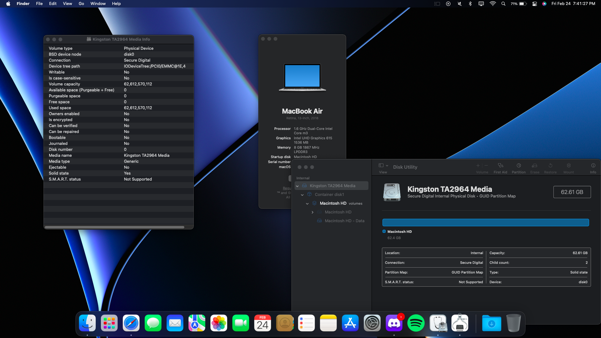

# Installing macOS on an Asus C425

--------------------------------------------------------------------------------------------------------------------------------------------------------

## Table of Contents
- [Current Status](#current-status)
- [Versions Tested](#versions-tested)
- [**Disclaimer**](#%EF%B8%8F-disclaimer-%EF%B8%8F)
- [Requirements](#requirements)
- [Issues](#issues)
  - [Current Issues](#current-issues)
  - [Fixed Issues](#fixed-issues)
- [**Installation**](#installation)
- [Steps required for proper functioning.](#these-steps-are-required-for-proper-functioning)
- [Items not mentioned in the Dortania guide that you need to do:](#items-not-mentioned-in-the-dortania-guide-that-you-need-to-do) 
- [Kext Folder](#kexts)
- [ACPI Folder](#acpi-folder)
- [Misc. Information](#misc-information)
- [macOS Ventura](#macos-ventura)
  - [For those updating](#for-those-updating)
  - [For those installing directly](#preparations-for-installing-ventura-directly)
  - [Fixing WiFI](#fixing-wifi-on-ventura)
- [Credits](#credits)

--------------------------------------------------------------------------------------------------------------------------------------------------------

Turns out, this laptop works really well with the latest version(s) of macOS. For more information about the Chromebook's hardware, see [here](https://github.com/meghan06/ChromebookOSX/blob/main/Hardware.txt).

| macOS Ventura | eMMC Storage |
|------------|-------------|
|||
--------------------------------------------------------------------------------------------------------------------------------------------------------

## Current Status

| **Feature**        | **Status**           | **Notes**                                                                                     |
|--------------------|----------------------|-----------------------------------------------------------------------------------------------|
| WiFi               | Working              | With `itlwm.kext v2.2.0 alpha` and `Heliport v1.4.1` `(Latest)`.                              |
| Bluetooth          | Working              | With `IntelBluetoothFirmware` and `BlueToolFixup.kext`.                                       |
| Suspend / Sleep    | Working partially    | Only on battery power, working with `EmeraldSDHC.kext`.                                       |
| Trackpad           | Working              | With `VoodooI2C.kext` and `VoodooI2CELAN.kext`.                                               | 
| Graphics Accel.    | Working              | With `-igfxnotelemetryload` in the `boot-args`.                                               |
| Internal Speakers  | Not working          | Unsupported codec. (`max98927`)                                                               |
| Keyboard backlight | Working              | With `SSDT-KBBl.aml` _**and**_ `VoodoolPS2-Chromebook.kext`.                                    |                                           
| Keyboard & Remaps  | Working              | With `VoodoolPS2-Chromebook.kext`.                                                            |
| eMMC Storage       | Working              | With `EmeraldSDHC.kext`.                                                                      |
| SD Card Reader     | Not working          | Coming soon with `EmeraldSDHC.kext`.                                                          |
| USB Ports          | Working              | Make sure to map your USB ports with `USBMap.kext`(macOS) or `USBToolbox.kext` (Windows/Linux).|
| Webcam             | Working              | Working OOTB with / without USB Mapping.                                                      |
| Internal Mic.      | Not working          | Same reason why internal speakers don't work; unsupported codec. (`max98927`)                 |
| Logout / Lock      | Working              | Working OOTB.                                                                                 |
| Shutdown / Restart | Working              | Working with `ProtectMemoryReigons` enabled in ProperTree. Under `Booter` -> `Quirks`. **WILL not             work if disabled.** |    
| Recovery key combos| Working              | Working OOTB with coreboot. (Recovery combos are `esc`+`power`+`refresh` and `power button`+`refresh` )

 
I will not provide the EFI, as creating it yourself can be a valuable learning experience. By providing comprehensive guidance, I have already given away almost all the necessary information. So, take this opportunity to learn and have fun! :)

--------------------------------------------------------------------------------------------------------------------------------------------------------
### Versions Tested
- [macOS 10.14](https://preview.redd.it/du0a3cftqw7a1.png?width=1920&format=png&auto=webp&v=enabled&s=ac6d75fcfe423f12fe27aae947f89a55c00f7590)
- [macOS 10.15](https://media.discordapp.net/attachments/302485086060937219/1064325342787026955/image.png?width=1119&height=629)
- [macOS 11](https://cdn.discordapp.com/attachments/1051619981642706947/1078427190129070183/image.png)
- [macOS 12](https://media.discordapp.net/attachments/1051619981642706947/1078426568319320085/image.png?width=1119&height=629)
- [macOS 13](https://preview.redd.it/sdlqqbufnbfa1.png?width=1920&format=png&auto=webp&v=enabled&s=e38a2085eaf2021061b2b0a23ab3214a044eb50e)

macOS 10.1x were tested on external USB drives, so eMMC support may vary. For best experience, just install Big Sur (11) or newer.

--------------------------------------------------------------------------------------------------------------------------------------------------------

### ⚠️ Disclaimer ⚠️

**By continuing, you acknowledge that you have read and understood the contents of [LICENSE.md](LICENSE.md) and the [above disclaimer](#%EF%B8%8F-disclaimer-%EF%B8%8F), and consent to their terms.**

**The instructions outlined in this document have the potential to cause permanent harm to your laptop, and you should be aware of this potential outcome before proceeding. I cannot be held accountable for any damage resulting from following or disregarding these instructions and make no promises regarding the reliability or efficiency of the software contained in this repository. Please refer to [LICENSE.md](LICENSE.md) for more detailed information.** 

TLDR: If you fuck up and break something, **it's not my fault.**

--------------------------------------------------------------------------------------------------------------------------------------------------------

### Requirements

Before you start, you'll need to have the following items to complete the process:

- **An understanding that this process has the potential to damage / brick your device, potentially causing it to become forever inoperable.**
- An external storage device (can range from a SD card to a USB Disk / Drive) for creating the installer USB.  
- The latest OpenCore version (**at least 0.8.8**) for eMMC boot drive support.   
- An internet connection.

--------------------------------------------------------------------------------------------------------------------------------------------------------

### Issues

#### Current Issues
- Render and video playback issues after sleep. ~~(Need help)~~ - Potential fix below
  - Have not tested much yet but adding `igfxrpsc=1` to boot-args seems to fix this. 
 
#### Fixed Issues
- ~~Random freezing in Safari tabs (mostly video playback tabs like YouTube)~~ - See **possible** fix below.
  - Disable `Optimized video streaming while on battery` and it'll fix it.
- ~~Random render issues on Discord and Spotify.~~
  - To fix this, disable GPU acceleration in settings and it'll fix it.
- ~~Weird lock ups randomly.~~
  - Fixed.
- ~~Signout not working~~
  - Fixed by reinstalling; more of an config issue.
- ~~Kernel panic when shutting down / restarting~~
  - Fixed by setting `ProtectMemoryReigons` to `TRUE`.
- **Report other issues in [Issues](https://github.com/meghan06/ChromebookOSX/issues)**

--------------------------------------------------------------------------------------------------------------------------------------------------------

## Installation

Here are the steps to go from chromeOS to macOS via OpenCore on your Chromebook. 

### **These steps are **required** for proper functioning.**
1. If you haven't already, flash your Chromebook with [MrChromebox's UEFI firmware](https://mrchromebox.tech) via his scripts. To complete this process, you must turn off write protection either by using a SuzyQable cable or temporarily removing the battery (latter is less cumbersome).
2. Setup your EFI folder using the [OpenCore Guide](https://dortania.github.io/OpenCore-Install-Guide/). Use Kaby Lake Laptop for your `config.plist`.
3. Switch the regular VoodoolPS2 with this [custom build](https://github.com/one8three/VoodooPS2-Chromebook/releases) for keyboard backlight control + custom remaps 
   - Keyboard backlight SSDT (`SSDT-KBBL.aml`) can be found [here](https://github.com/one8three/VoodooPS2-Chromebook/blob/master/SSDT-KBBL.aml). 
      - **This SSDT **ONLY** works with the custom VoodoolPS2 version linked in Step 3.**
4. Download corpnewt's SSDTTime, then launch it and select `FixHPET` as the first option. Next, select `'C'` for the default setting, and drag the resulting SSDT file (`SSDT-HPET`) into your `ACPI` folder. Finally, copy the patches from `oc_patches.plist` into your `config.plist` under `ACPI -> Patch`, which will resolve the issue of eMMC not being detected by macOS (which is caused by a bug with EmeraldSDHC).
5. Map your USB ports via USBToolBox in Windows before installing ~~to prevent dead hard drives, thermonuclear war, or you getting fired.~~ See [Misc. Information](#misc-information) for a note to USBToolBox users.    
6. Add `igfxrpsc=1` and `-igfxnotelemetryload` to your `boot-args`, under `NVRAM -> Add -> 7C436110-AB2A-4BBB-A880-FE41995C9F82,`. Both are for iGPU support, **you will regret it if you don't add these.**
7. Install macOS and enjoy!

Note: More information about `ProtectMemoryReigons` can be found [here](https://dortania.github.io/docs/latest/Configuration.html).

Note for **Step 4**: This may have been resolved in a recent update, but I have not yet confirmed. Try booting without the IRQ patches mentioned earlier, and if your eMMC drive is not recognized in Disk Utility, you will need to add those patches. If the drive still fails to appear, there may be a mistake in one of the preceding steps, or your eMMC drive may not be supported at this time.

--------------------------------------------------------------------------------------------------------------------------------------------------------

### Items not mentioned in the Dortania guide that you **need** to do:

   you will regret it later if you don't
   1. Use Laptop Kaby Lake for your config.plist 
   2. ***In your `config.plist`, under `Booter -> Quirks` set `ProtectMemoryReigons` to `TRUE` if you want working shutdown/restart/WiFi. You MUST  change this. It is `FALSE` by DEFAULT.**
   3. In your `boot-args`, (`NVRAM -> Add -> 7C436110-AB2A-4BBB-A880-FE41995C9F82,`) add `igfxrpsc=1` and `-igfxnotelemetryload` for iGPU acceleration. 
   4. Despite what the guide says, your SMBIOS should be `MacBookAir8,1`. 
      - If you choose to use `MacBook10,1`, you will NOT have Low Battery Mode.
   5. Want to use internal eMMC storage? You'll need `EmeraldSDHC.kext`. [Download is here](https://github.com/acidanthera/EmeraldSDHC/releases) 
      -  **Note: eMMC driver only works on macOS 11 and up.**
    
--------------------------------------------------------------------------------------------------------------------------------------------------------

### Kext's.

You can find a list of what I used [here.](https://github.com/meghan06/ChromebookOSX/blob/main/list%20of%20installed%20kext's.png)

--------------------------------------------------------------------------------------------------------------------------------------------------------
### ACPI Folder

You can find a list of what I used [here.](https://github.com/meghan06/ChromebookOSX/blob/main/ACPI%20Folder.png)

--------------------------------------------------------------------------------------------------------------------------------------------------------

### Misc. Information

- *When formatting the eMMC drive in Disk Utility, make sure to toggle "Show all Drives" and **erase the WHOLE drive**, not just the current partition.
- Format the drive as `APFS`
- Map your USB ports prior to installing macOS for a painless install. You **will** reget it if you don't. You can use [USBToolBox](https://github.com/USBToolBox/tool) to do that.
- `itlwm` is more stable & faster than `AirportItlwm`
- You might have DRM issues, there's no fix for this. :(
- Control keyboard backlight with left `ctrl` + left `alt` and `<` `>`. 
    - `<` to decrease, `>` to increase.
- To fix the battery life on Ventura, you can set Low Battery Mode to be always enabled on battery. It's not perfect, but it helps. You can also use CPUFriend to tweak power settings but it might break sleep.
- eMMC will come up as an external drive in the boot picker since eMMC is just an embedded SD card. Nothing you can do about it.
- To hide the drive picker, set `ShowPicker` to `False` in `Misc` ->` Boot` -> `ShowPicker`
- `AppleXcpmCfgLock` and `DisableIOMapper` can be enabled or disabled. Makes no difference.
- It's worth noting that while it's recommended, coreboot already includes mapped USB ports, meaning that USB mapping is not required. Proceed at your  own risk if you decide to skip USB mapping.
- If you are using USBToolBox (Mainly Windows users), you need a second kext that goes along with it. [Github repo here](https://github.com/USBToolBox/kext). USBToolBox will not work without this kext. 
- Make sure your `ScanPolicy` is set to `0`. eMMC will not be recognized if it's some other value.

#### *Note: The hotkey to show drives **DOES NOT WORK**. Make a copy of your EFI with `ShowPicker` enabled if you need to boot from another drive.

--------------------------------------------------------------------------------------------------------------------------------------------------------

## macOS Ventura
#### Only for those who want macOS Ventura. 

Before we get started, you should know the following:
- **Your battery will drain faster on Ventura.** To avoid this, stay on Monterey or older.

With that, lets get started!

--------------------------------------------------------------------------------------------------------------------------------------------------------

### For those updating:
Note: these steps can be done after updating, you just won't have WiFi. It is recommended to follow the steps below **before** updating for the least amount of pain and suffering.

1. Mount your EFI using corpnewt's MountEFI.
2. Under OC/Kexts, delete your old itlwm/AirportItlwm kext and replace it with `itlwm v.2.2.0 alpha`
3. Download and install Heliport if you haven't already. The most recent stable release will work fine.
4. Launch ProperTree and reload (`ctrl+r`) your `config.plist`. 
5. Start the update. (If you haven't already)
6. You are now ready for macOS Ventura! 
7. [See below](#fixing-wifi-on-ventura) for fixing WiFi.

--------------------------------------------------------------------------------------------------------------------------------------------------------

### Preparations for installing Ventura directly:
Note: For Windows only, not sure how it's like on Linux.
1. Under OC/Kexts, delete your old itlwm/AirportItlwm kext and replace it with `itlwm v.2.2.0 alpha`
2. Open up your kext folder, and locate `itlwm.kext`. 
3. Open it, and find `Info.plist`.
4. Open ProperTree, navigate to where your `Info.plist` is, and open it.
5. Under `IOKitPersonalities -> itlwm -> WiFiConfig`, enter your WiFI details. Save and close when done.
7. Launch ProperTree and reload (`ctrl+r`) your `config.plist`. 
8. Boot recovery. There will be no WiFi logo/symbol, but you will have WiFi. If you are able to install macOS, then you have not fucked up.
--------------------------------------------------------------------------------------------------------------------------------------------------------

### Fixing WiFi on Ventura 
**Only for those that have macOS installed but haven't edited their `Info.plist`.**

Before we begin, let me explain how this patch functions. The `Info.plist` file in itlwm has a section where you can manually enter the SSID and password of your network. By doing this, you can connect to your network without relying on HeliPort. This approach is also works for recovery. To accomplish this, we will enter your network details in the aforementioned `Info.plist` file, thus avoiding the roughly 30 second wait required for HeliPort to initialize, scan, and connect. It's essential to remember that while this approach allows you to connect to your network, you still need HeliPort to access features such as a WiFi logo, the ability to pair with other networks, and several others that I am unable to remember.

TLDR: Add your primary network's credentials to `itlwm.kext`'s `Info.plist` so you can skip the initialization period required by HeliPort.
With that said, we can get started.

1. Mount your EFI
2. Open up your kext folder, and locate `itlwm.kext`. 
3. Click it, and select `Show Package Contents` and open the Contents folder. Once inside, find the `Info.plist` and copy it via  `ctrl + c`.
4. Exit `itlwm.kext` and go back to your Kext folder. Paste your `Info.plist`.
5. Open ProperTree, select the `Info.plist` in your Kext folder and open it.
6. Under `IOKitPersonalities -> itlwm -> WiFiConfig`, enter your WiFI details. Save and close when done.
7. Replace the old `Info.plist` with the one you just edited. 

Do note that Heliport will report no WiFi upon logging in but keep in mind you actually do thanks to the edits we just made. :) 

--------------------------------------------------------------------------------------------------------------------------------------------------------

### Credits
- **Goldfish64** for the eMMC driver and iGPU acceleration. 
- **corpnewt** for his tools.
- **olm3ca** for the help along the way.
- **coolstar** for the help along the way.
- and many, many others.

--------------------------------------------------------------------------------------------------------------------------------------------------------

#### Last Updated: 02/24/2023

--------------------------------------------------------------------------------------------------------------------------------------------------------
